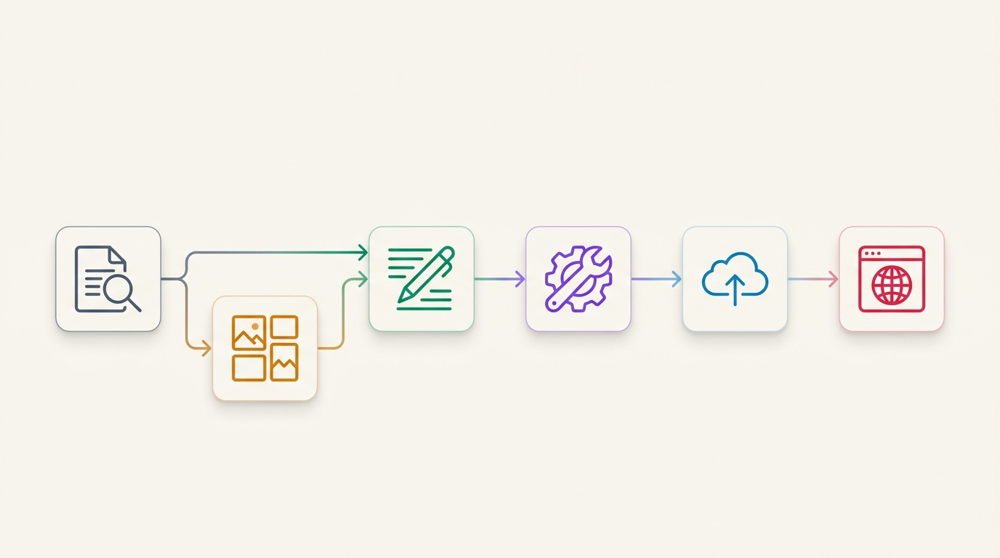

# 📝 Tech Blog Publisher

[](LICENSE)
[](https://nodejs.org/)
[](https://www.python.org/)
[](https://github.com/unoShin/tech-blog-publisher)

> **"단순 텍스트 요약을 넘어, 논문의 도표·수식·아키텍처까지 픽셀 단위로 추출하여 완성하는 완전 자율형 테크 블로그 퍼블리싱 파이프라인"**

---

## 📑 목차 (Table of Contents)

- [💡 핵심 차별점: 왜 Layout Detection인가?](#-핵심-차별점-왜-layout-detection인가)
- [✨ 소개](#-소개)
- [📌 실제 발행 예시](#-실제-발행-예시)
- [📦 포함된 스킬 & 파이프라인](#-포함된-스킬--파이프라인)
- [🚀 빠른 시작](#-빠른-시작)
- [📖 사용 방법](#-사용-방법)
  - [AI 에이전트에서 스킬로 사용](#ai-에이전트에서-스킬로-사용하기)
  - [수동 CLI 워크플로우](#수동-워크플로우)
- [🏗️ 프로젝트 구조](#-프로젝트-구조)
- [🛡️ Zero-Defect 린터 규칙](#-zero-defect-린터-규칙)
- [🎨 HTML 테마 특징](#-html-테마-특징)
- [🤝 기여하기 & 📄 라이선스](#-기여하기)

---

## 💡 핵심 차별점: 왜 Layout Detection인가?

### 💥 AS-IS: "글 쓰는 것보다, 논문에서 이미지를 가져오는 게 훨씬 어렵습니다"

LLM을 이용해 논문 텍스트를 요약하거나 글을 생성하는 것은 이제 누구나 할 수 있습니다.  
하지만 **시니어 엔지니어 수준의 깊이 있는 기술 블로그**를 만들려면 **아키텍처 다이어그램, 벤치마크 표, 핵심 수식**이 필수적입니다. 기존 방식들은 여기서 모두 실패합니다:

| 기존 방식 | 문제점 | 결과 |
|:---|:---|:---|
| **`pdfimages` / 단순 래스터 추출** | 벡터 차트, 표, 복합 수식을 인식하지 못하고 파편화된 비트맵 조각만 추출 | ❌ 깨진 이미지, 도표 누락 |
| **멀티모달 LLM 통째 입력** | 2단(Multi-column) 복잡한 논문 레이아웃에서 특정 Figure만 고해상도로 정밀 크롭 불가 | ❌ 저화질, 잘못된 영역 크롭 |
| **수동 캡처 & 붙여넣기** | 결국 엔지니어가 논문을 열고 일일이 캡처 도구로 잘라내야 함 | ❌ 완전 자동화 파이프라인의 붕괴 |

---

### ⚡ TO-BE: Vision AI (DocLayout-YOLO) 기반 지능형 레이아웃 파싱

**Tech Blog Publisher**는 텍스트 생성 이전에 **Document Layout Analysis (DLA)**를 파이프라인의 핵심 코어로 통합했습니다:

1. 🎯 **DocLayout-YOLO (SOTA DLA)**: 논문 PDF를 200 DPI로 렌더링한 뒤, 딥러닝 객체 탐지 모델이 **Figure(그림/차트), Table(도표), Formula(수식)**의 경계 상자를 픽셀 단위로 정밀 검출하여 무손실 크롭합니다.
2. 🌐 **Headless Chrome 다이어그램 캡처**: 웹 기술 블로그의 인라인 React/SVG/Canvas 컴포넌트도 CDP WebSocket을 통해 고해상도(2x Scale)로 실시간 캡처합니다.
3. 🔗 **맥락 기반 자동 결합**: 추출된 고해상도 시각 자료가 5단계 황금 구조 본문에 `Figure 1, 2...`로 자동 배치되고, Google Drive CDN으로 즉시 호스팅됩니다.

---

## ✨ 소개

**Tech Blog Publisher**는 AI 코딩 에이전트를 위한 스킬(Skill) 패키지입니다.

arXiv 논문(PDF) 또는 기술 아티클(URL)을 입력하면, 에이전트가 **레이아웃 비전 파싱 → 5단계 구조화 → 한국어 심층 작성 → 다이어그램 캡처 → 이미지 CDN 업로드 → HTML 컴파일 → 블로그 발행**까지 전 과정을 원스톱으로 수행합니다.

> 💡 **에이전트 호환성**: 이 프로젝트는 [Antigravity(AGY)](https://antigravity.dev)의 스킬 시스템을 기준으로 개발되었지만, `SKILL.md`의 구조와 프롬프트는 범용적으로 설계되어 있어 **Cursor, Cline, Windsurf, Claude Code** 등 다양한 AI 에이전트에서도 즉시 참고하고 활용할 수 있습니다.

---

## 📌 실제 발행 예시

> 🔗 **[엔비디아의 충격적인 진화 알고리즘: 블랙웰 B200에서 cuDNN과 FlashAttention-4를 능가한 AVO](https://escape-engineering.tistory.com/entry/%EC%97%94%EB%B9%84%EB%94%94%EC%95%84%EC%9D%98-%EC%B6%A9%EA%B2%A9%EC%A0%81%EC%9D%B8-%EC%A7%84%ED%99%94-%EC%95%8C%EA%B3%A0%EB%A6%AC%EC%A6%98-%EB%B8%94%EB%9E%99%EC%9B%B0-B200%EC%97%90%EC%84%9C-cuDNN%EA%B3%BC-FlashAttention-4%EB%A5%BC-%EB%8A%A5%EA%B0%80%ED%95%9C-AVO)**
>
> 이 파이프라인으로 제작된 실제 테크 블로그 포스트입니다. 논문 분석부터 5단계 황금 구조 작성, DocLayout-YOLO 다이어그램 정밀 캡처, HTML 에디토리얼 테마 컴파일까지 전 과정이 자동화되었습니다.

---

## 📦 포함된 스킬 & 파이프라인

저장소에는 2개의 독립적인 스킬이 포함되어 있으며, 하나의 파이프라인으로 유기적으로 연계됩니다:

| 스킬 | 경로 | 핵심 역할 |
|------|------|------|
| **PDF Layout Extractor** | `pdf_layout_extractor/` | **[Vision DLA]** DocLayout-YOLO 모델로 PDF 논문에서 도표·수식·그림을 픽셀 단위로 정밀 검출 & 크롭 |
| **Tech Blog Publisher** | `tech-blog-publisher/` | **[Pipeline Core]** 추출된 시각 자료와 기술 문서를 5단계 황금 구조로 결합하고 반응형 웹/블로그 HTML로 컴파일 |

<p align="center">
  
</p>

---

## 🚀 빠른 시작

### 1. 저장소 복제 & 의존성 설치

```bash
git clone https://github.com/unoShin/tech-blog-publisher.git
cd tech-blog-publisher/tech-blog-publisher
npm install
```

### 2. 환경 설정

#### 1) 필수 환경
- **Node.js** ≥ 18.0.0
- **Headless Chrome** (`google-chrome` 또는 `chromium-browser`) — 웹 다이어그램 자동 캡처 시 필요

#### 2) PDF 레이아웃 추출 환경 (논문 이미지 정밀 파싱)
- **Python** ≥ 3.10 (Conda 권장)
- **DocLayout-YOLO** 모델 체크포인트 (`.pt` 파일)
- **pdftoppm** (`poppler-utils`)

```bash
# poppler 설치 (Ubuntu/Debian)
sudo apt-get install -y poppler-utils
```

#### 3) 선택: Google Drive CDN 연동
이미지를 Google Drive CDN(`https://lh3.googleusercontent.com/d/...`)으로 자동 호스팅하려면:

1. [Google Cloud Console](https://console.cloud.google.com/)에서 프로젝트 생성 및 Google Drive API 활성화
2. 서비스 계정 키(`service_account.json`)를 프로젝트 루트에 배치
3. CDN 폴더를 생성하고 서비스 계정 이메일을 **편집자(Editor)**로 공유

> 💡 Google Drive 설정을 생략하면 로컬 상대 경로로 안전하게 폴백 빌드됩니다.

---

## 📖 사용 방법

### AI 에이전트에서 스킬로 사용하기

#### 1) Antigravity (AGY)
스킬 디렉토리를 Antigravity 스킬 경로로 복사합니다:

```bash
# 글로벌 스킬 등록
cp -r tech-blog-publisher ~/.gemini/config/skills/
cp -r pdf_layout_extractor ~/.gemini/config/skills/

# 또는 프로젝트 스킬 등록
cp -r tech-blog-publisher <project-root>/.gemini/skills/
cp -r pdf_layout_extractor <project-root>/.gemini/skills/
```

에이전트에게 자연어로 요청:
```text
"이 arXiv 논문(URL/PDF)에서 핵심 아키텍처 다이어그램과 수식을 추출하고, 한국어 심층 테크 블로그로 작성해줘"
```

#### 2) 기타 AI 에이전트 (Cursor, Cline, Windsurf, Claude Code 등)
- **프롬프트 활용**: `SKILL.md` 내용을 System Prompt나 Custom Instructions에 주입하여 사용
- **표준 가이드 참고**: 5단계 황금 구조, 린팅 룰, 스타일 가이드를 작성 지침으로 직접 활용
- **독립 CLI 실행**: 빌드/린터/캡처/레이아웃 추출 스크립트를 독립 CLI 도구로 실행

---

### 수동 워크플로우

```text
drafts/260828_01/
├── index.md        # 5단계 황금 구조 초안 (YAML Front-matter)
├── thumbnail.jpg   # Notion 2D 썸네일 (1:1 비율, 텍스트 배제)
└── fig1.png        # 추출 또는 캡처된 본문 이미지
```

1. **PDF 도표 추출 (논문)**:
   ```bash
   python scripts/extract_layout_images.py paper.pdf drafts/260828_01/
   ```
2. **다이어그램 캡처 (웹 아티클)**:
   ```bash
   node scripts/capture_diagrams.js "<URL>" "drafts/260828_01/"
   ```
3. **초안 작성**: `templates/post-template.md` 기반으로 5단계 구조 작성
   - 🪝 1. 문제의식과 핵심 제안 (Hook & Paradigm Shift)
   - 🏗️ 2. 심층 아키텍처 및 메커니즘 (Deep Architecture)
   - 📊 3. 정량 벤치마크 및 한계 분석 (Quantitative Benchmarks)
   - ⚙️ 4. 시스템 구현 및 엔지니어링 분석 (System Engineering)
   - 🎯 5. 결론 및 핵심 요약 (Conclusion & Key Takeaways)
4. **품질 검증 (Lint)**:
   ```bash
   npm run verify -- drafts/260828_01/index.md
   ```
5. **컴파일 (Build)**:
   ```bash
   npm run build -- drafts/260828_01/index.md
   ```
6. **발행**: 생성된 `dist/260828_01/index.html`을 블로그 플랫폼(Tistory 등)의 HTML 모드에 붙여넣기

---

## 🏗️ 프로젝트 구조

```text
tech-blog-publisher/
├── pdf_layout_extractor/             # 🔍 [Vision DLA] PDF 레이아웃 정밀 추출 스킬
│   └── SKILL.md                      # DocLayout-YOLO 스킬 명세서
│
├── tech-blog-publisher/              # ✍️ [Pipeline Core] 발행 파이프라인 스킬
│   ├── SKILL.md                      # 스킬 마스터 명세서
│   ├── package.json                  # Node.js 의존성 및 실행 스크립트
│   ├── scripts/
│   │   ├── build.js                  # 린터 + CDN + HTML 통합 컴파일러
│   │   ├── drive.js                  # Google Drive CDN 증분 업로더
│   │   ├── verify_post.js            # 26대 규칙 Zero-Defect 린터
│   │   ├── capture_diagrams.js       # Headless Chrome 다이어그램 캡처
│   │   └── extract_layout_images.py  # YOLO 기반 PDF 도표 정밀 크로퍼
│   ├── templates/
│   │   ├── post-template.md          # 5단계 황금 구조 마크다운 템플릿
│   │   └── template.html             # 에디토리얼 HSL 디자인 시스템 테마
│   └── references/
│       ├── instructions.md           # 마스터 운영 지침
│       └── lessons.md                # 26대 품질 개선 누적 교훈집
│
├── assets/                           # 문서 에셋 (다이어그램 등)
├── .gitignore
├── LICENSE
└── README.md
```

---

## 🛡️ Zero-Defect 린터 규칙

빌드 전 자동 실행되어 렌더링 결함과 파싱 에러를 사전에 차단합니다:

| 구분 | 규칙 | 설명 |
|:---:|------|------|
| **메타데이터** | Front-matter 필수 필드 | `title`, `date`, `category`, `thumbnail`, `description`, `tags` (10개 이상) |
| **제목/텍스트** | 제목 영문 괄호 표기 | `한글 제목 (English Title)` 형식 준수 |
| **파싱 보호** | Bold-Code 중첩 금지 | `**`\`코드\` `**` 중첩 방지 → `**텍스트** (\`코드\`)` 분리 |
| **엔진 버그** | 물결표(`~`) 단독 금지 | `<del>` 취소선 오인식 방지를 위해 엔 대시(`–`) 사용 |
| **수식 처리** | LaTeX `$` 직문 방지 | 블로그 엔진 충돌 방지를 위해 인라인 코드 백틱 사용 |
| **무결성** | 외부 링크 라이브 검증 | HTTP HEAD 요청으로 404 깨진 링크 사전 차단 |
| **시각 요소** | Figure 순번 일관성 | 본문 등장 순서대로 `Figure 1, 2...` 자동 검증 |

<details>
<summary><b>전체 26대 세부 규칙 보기 (Click to expand)</b></summary>

전체 26개 규칙과 실제 트러블슈팅 사례는 [`tech-blog-publisher/references/lessons.md`](tech-blog-publisher/references/lessons.md)에서 확인하실 수 있습니다.
</details>

---

## 🎨 HTML 테마 특징

컴파일된 결과물은 세련된 에디토리얼 디자인 시스템을 기본 탑재합니다:

- **Typography**: 본문 `Pretendard`, 세리프 악센트 `Newsreader`, 코드 `JetBrains Mono`
- **Code Highlight**: GitHub Dark 테마 팔레트 (`highlight.js`)
- **Callout Cards**: Tone-on-tone 컬러 시스템 (NOTE, TIP, WARNING, IMPORTANT, CAUTION)
- **Table of Contents**: 스킨 충돌 없는 순수 Div/Flex 기반 인터랙티브 목차
- **Mobile Responsive**: 768px 모바일 최적화 및 와이드 표 가로 스크롤 보존
- **SEO & Lightbox**: Google SEO용 `TechArticle` JSON-LD 스키마 및 네이티브 라이트박스(`data-phocus`) 지원

---

## 🤝 기여하기

### 기여 환영 분야
- 🌐 **플랫폼 확장**: Velog, Medium, WordPress 등 추가 블로그 플랫폼용 템플릿/컴파일러
- 🛡️ **린터 룰 확장**: 새로운 마크다운 엣지 케이스 대응 린터 규칙
- 🎨 **테마 다양화**: 라이트/다크 모드, 미니멀 테마 등 신규 HTML 템플릿
- 🌍 **다국어 지원**: 영문/일문 기술 블로그 퍼블리싱 파이프라인

```bash
# 빠른 기여 절차
git checkout -b feature/amazing-feature
git commit -m 'Add amazing feature'
git push origin feature/amazing-feature
# 이후 GitHub에서 Pull Request 생성
```

---

## 📄 라이선스

이 프로젝트는 [MIT 라이선스](LICENSE) 하에 배포됩니다.
